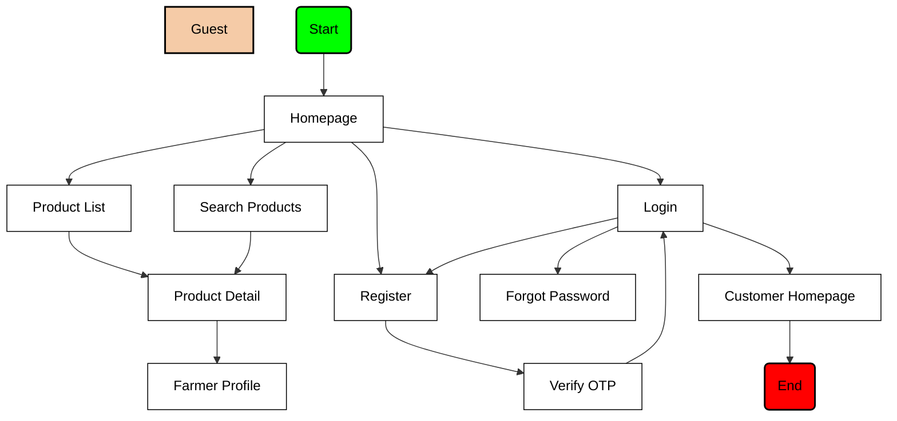
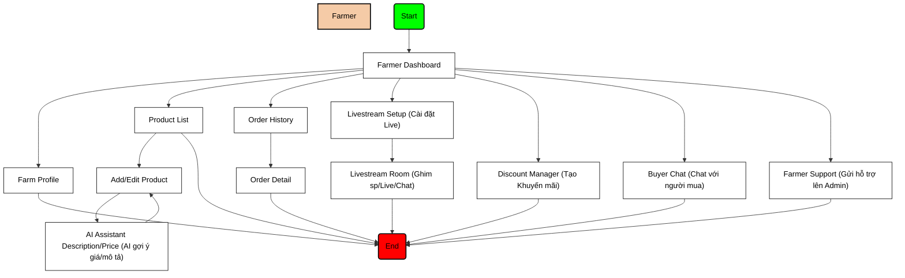
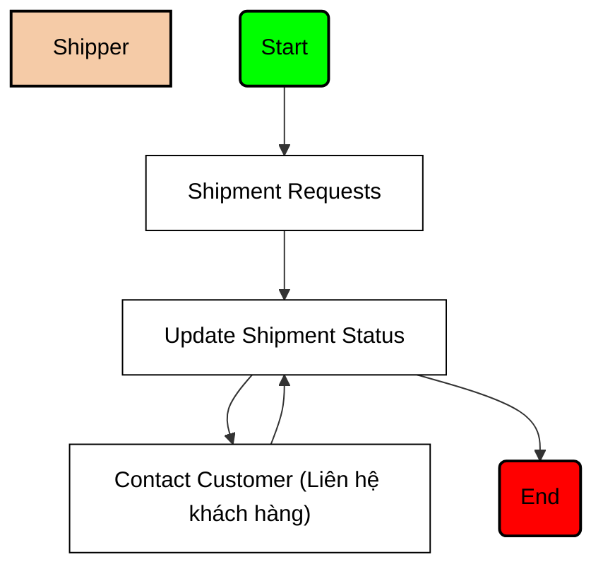

# BÁO CÁO PHÂN TÍCH LUỒNG MÀN HÌNH (SCREEN FLOW REPORT)
## HỆ THỐNG AGRIMARKET

Tài liệu này cung cấp sơ đồ và mô tả chi tiết luồng màn hình (Screen Flow) của hệ thống **AgriMarket** - Sàn thương mại điện tử kết nối nông sản trực tiếp từ nhà vườn tới tay người tiêu dùng.

Báo cáo được cấu trúc chi tiết phục vụ cho báo cáo dự án môn **SWP391** tại Đại học FPT.

---

## I. CÁC VAI TRÒ TRONG HỆ THỐNG (SYSTEM ROLES)

Hệ thống AgriMarket bao gồm 4 vai trò chính với các đặc quyền truy cập và luồng màn hình riêng biệt:

1.  **Khách vãng lai (Guest) / Khách hàng (Customer)**: Mua sắm nông sản, quản lý giỏ hàng, đặt hàng, thanh toán và gửi đánh giá sản phẩm.
2.  **Nhà vườn / Nông dân (Farmer)**: Đăng bán sản phẩm, quản lý kho hàng, quản lý và xác nhận đơn hàng của nông trại, quản lý hồ sơ nhà vườn, sử dụng trợ lý AI hỗ trợ kinh doanh.
3.  **Quản trị viên (Admin)**: Quản lý tài khoản toàn hệ thống, phê duyệt sản phẩm nông sản của Farmer đăng bán (hỗ trợ bởi AI Content Moderation), quản lý đơn hàng tổng quát.
4.  **Đơn vị vận chuyển (Shipper)**: Tiếp nhận các yêu cầu vận chuyển đơn hàng, cập nhật các trạng thái lấy hàng, đang giao, giao thành công/thất bại.

---

## II. SƠ ĐỒ LUỒNG MÀN HÌNH TỪNG VAI TRÒ (STYLIZED SCREEN FLOWS)

Dưới đây là sơ đồ luồng màn hình được vẽ theo định dạng trực quan (sử dụng các khối màu tương ứng: màu Cam cho Vai trò, màu Xanh lá cho Điểm bắt đầu, màu Đỏ cho Điểm kết thúc và màu Trắng cho các Màn hình giao diện).

### 1. Luồng màn hình của Khách vãng lai (Guest Flow)

---

### 2. Luồng màn hình của Khách mua hàng đã đăng nhập (Customer Flow - Bao gồm cả tính năng tương lai)

```mermaid
flowchart TD
    %% Node definitions
    Customer["Customer"]
    Start("Start")
    End("End")
    CustomerHomepage["Customer Homepage"]
    Cart["Cart Page"]
    Checkout["Checkout Page (Apply Voucher)"]
    Payment["Payment Page"]
    OrderHistory["Order History"]
    OrderDetail["Order Detail"]
    ProductReview["Product Review"]
    Profile["Profile (Dashboard Cá nhân)"]
    EditProfile["Edit Profile"]
    ChangePassword["Change Password"]
    FarmerRegister["Farmer Register"]

    %% Future Features Nodes
    PreOrder["Pre-order Crops (Đặt trước mùa vụ)"]
    Wishlist["Wishlist (Sản phẩm yêu thích)"]
    FollowList["Farmer Follow List (Nhà vườn theo dõi)"]
    FarmerChat["Farmer Chat Room (Chat với nông dân)"]
    AIChat["AI Chatbot Screen (Chat với AI)"]
    AddressManager["Address Manager (Thêm/Sửa/Chọn Mặc định)"]
    RecentlyViewed["Recently Viewed Products"]
    SubmitReport["Submit Violation Report (Báo cáo vi phạm)"]
    SupportRequest["Support Request (Gửi hỗ trợ lên Admin)"]

    %% Connections
    Start --> CustomerHomepage
    CustomerHomepage --> Cart
    CustomerHomepage --> OrderHistory
    CustomerHomepage --> Profile
    CustomerHomepage --> AIChat
    CustomerHomepage --> RecentlyViewed
    
    %% Buying & Pre-order Connections
    CustomerHomepage --> PreOrder
    Cart --> Checkout
    Checkout --> Payment
    Payment --> OrderHistory
    OrderHistory --> OrderDetail
    OrderDetail --> ProductReview
    ProductReview --> End
    
    %% Product Detail interactions
    ProductDetail["Product Detail"] --> Cart
    ProductDetail --> PreOrder
    ProductDetail --> FarmerChat
    ProductDetail --> SubmitReport
    
    %% Profile Connections
    Profile --> EditProfile
    Profile --> ChangePassword
    Profile --> FarmerRegister
    Profile --> Wishlist
    Profile --> FollowList
    Profile --> AddressManager
    Profile --> SupportRequest
    
    %% Ends
    EditProfile --> End
    ChangePassword --> End
    FarmerRegister --> End
    Wishlist --> End
    FollowList --> End
    AddressManager --> End
    SupportRequest --> End
    SubmitReport --> End
    AIChat --> End
    RecentlyViewed --> End

    %% Styles matching the user's diagram
    style Customer fill:#F5CBA7,stroke:#000000,stroke-width:2px,color:#000000
    style Start fill:#00FF00,stroke:#000000,stroke-width:2px,color:#000000
    style End fill:#FF0000,stroke:#000000,stroke-width:2px,color:#000000
    style CustomerHomepage fill:#FFFFFF,stroke:#000000,stroke-width:1px,color:#000000
    style Cart fill:#FFFFFF,stroke:#000000,stroke-width:1px,color:#000000
    style Checkout fill:#FFFFFF,stroke:#000000,stroke-width:1px,color:#000000
    style Payment fill:#FFFFFF,stroke:#000000,stroke-width:1px,color:#000000
    style OrderHistory fill:#FFFFFF,stroke:#000000,stroke-width:1px,color:#000000
    style OrderDetail fill:#FFFFFF,stroke:#000000,stroke-width:1px,color:#000000
    style ProductReview fill:#FFFFFF,stroke:#000000,stroke-width:1px,color:#000000
    style Profile fill:#FFFFFF,stroke:#000000,stroke-width:1px,color:#000000
    style EditProfile fill:#FFFFFF,stroke:#000000,stroke-width:1px,color:#000000
    style ChangePassword fill:#FFFFFF,stroke:#000000,stroke-width:1px,color:#000000
    style FarmerRegister fill:#FFFFFF,stroke:#000000,stroke-width:1px,color:#000000
    style PreOrder fill:#FFFFFF,stroke:#000000,stroke-width:1px,color:#000000
    style Wishlist fill:#FFFFFF,stroke:#000000,stroke-width:1px,color:#000000
    style FollowList fill:#FFFFFF,stroke:#000000,stroke-width:1px,color:#000000
    style FarmerChat fill:#FFFFFF,stroke:#000000,stroke-width:1px,color:#000000
    style AIChat fill:#FFFFFF,stroke:#000000,stroke-width:1px,color:#000000
    style AddressManager fill:#FFFFFF,stroke:#000000,stroke-width:1px,color:#000000
    style RecentlyViewed fill:#FFFFFF,stroke:#000000,stroke-width:1px,color:#000000
    style SubmitReport fill:#FFFFFF,stroke:#000000,stroke-width:1px,color:#000000
    style SupportRequest fill:#FFFFFF,stroke:#000000,stroke-width:1px,color:#000000
```

---

### 3. Luồng màn hình của Nhà vườn / Nông dân (Farmer Flow - Bao gồm cả tính năng tương lai)

---

### 4. Luồng màn hình của Quản trị viên (Admin Flow - Bao gồm cả tính năng tương lai)

```mermaid
flowchart TD
    %% Node definitions
    Admin["Admin"]
    Start("Start")
    End("End")
    AdminDashboard["Admin Dashboard"]
    UserManagement["User Management"]
    CreateAccount["Create Account"]
    ProductApproval["Product Approval"]
    OrderManagement["Order Management"]

    %% Future Features Nodes
    ComplaintsList["Complaints List (Xem khiếu nại)"]
    ViolationReports["Violation Reports (Xem báo cáo vi phạm)"]
    SystemStats["System Stats & Reports (Thống kê hệ thống)"]
    NotificationManager["System Notification Manager"]
    VoucherManager["Voucher Manager (Tạo voucher)"]
    AIModerationLog["AI Content Moderation Log"]

    %% Connections
    Start --> AdminDashboard
    AdminDashboard --> UserManagement
    AdminDashboard --> ProductApproval
    AdminDashboard --> OrderManagement
    AdminDashboard --> ComplaintsList
    AdminDashboard --> ViolationReports
    AdminDashboard --> SystemStats
    AdminDashboard --> NotificationManager
    AdminDashboard --> VoucherManager
    AdminDashboard --> AIModerationLog
    
    %% User Management sub-flow
    UserManagement --> CreateAccount
    CreateAccount --> UserManagement
    
    %% Ends
    ProductApproval --> End
    OrderManagement --> End
    UserManagement --> End
    ComplaintsList --> End
    ViolationReports --> End
    SystemStats --> End
    NotificationManager --> End
    VoucherManager --> End
    AIModerationLog --> End

    %% Styles matching the user's diagram
    style Admin fill:#F5CBA7,stroke:#000000,stroke-width:2px,color:#000000
    style Start fill:#00FF00,stroke:#000000,stroke-width:2px,color:#000000
    style End fill:#FF0000,stroke:#000000,stroke-width:2px,color:#000000
    style AdminDashboard fill:#FFFFFF,stroke:#000000,stroke-width:1px,color:#000000
    style UserManagement fill:#FFFFFF,stroke:#000000,stroke-width:1px,color:#000000
    style CreateAccount fill:#FFFFFF,stroke:#000000,stroke-width:1px,color:#000000
    style ProductApproval fill:#FFFFFF,stroke:#000000,stroke-width:1px,color:#000000
    style OrderManagement fill:#FFFFFF,stroke:#000000,stroke-width:1px,color:#000000
    style ComplaintsList fill:#FFFFFF,stroke:#000000,stroke-width:1px,color:#000000
    style ViolationReports fill:#FFFFFF,stroke:#000000,stroke-width:1px,color:#000000
    style SystemStats fill:#FFFFFF,stroke:#000000,stroke-width:1px,color:#000000
    style NotificationManager fill:#FFFFFF,stroke:#000000,stroke-width:1px,color:#000000
    style VoucherManager fill:#FFFFFF,stroke:#000000,stroke-width:1px,color:#000000
    style AIModerationLog fill:#FFFFFF,stroke:#000000,stroke-width:1px,color:#000000
```

---

### 5. Luồng màn hình của Đơn vị vận chuyển (Shipper Flow - Bao gồm cả tính năng tương lai)

---

## III. CHI TIẾT LUỒNG MÀN HÌNH THEO TỪNG VAI TRÒ

### 1. Phân hệ Khách hàng (Customer) & Khách vãng lai (Guest)

Phân hệ này cho phép người dùng tìm kiếm sản phẩm, xem chi tiết, thêm vào giỏ hàng và thực hiện quy trình mua sắm.

| STT | Tên Màn Hình | Route | Chức Năng Chính | Luồng Tiếp Theo (Next Screens) |
| :--- | :--- | :--- | :--- | :--- |
| 1 | **Trang chủ (Home)** | `/` hoặc `/Home` | Xem sản phẩm nổi bật, banner, danh mục, nhà vườn tiêu biểu, gợi ý sản phẩm từ AI. | `/products`, `/products/:id`, `/login`, `/register`, `/cart` |
| 2 | **Đăng nhập (Login)** | `/login` | Xác thực người dùng bằng email/mật khẩu hoặc đăng nhập qua Google. | `/register`, `/forgot-password`, chuyển hướng về trang chủ hoặc trang dashboard của role tương ứng. |
| 3 | **Đăng ký (Register)** | `/register` | Tạo tài khoản khách hàng mới. | `/login` |
| 4 | **Quên & Đặt lại mật khẩu** | `/forgot-password`, `/reset-password` | Gửi mã OTP xác nhận qua email và đặt lại mật khẩu mới. | `/reset-success`, `/login` |
| 5 | **Danh sách Sản phẩm** | `/products` | Tìm kiếm nông sản, lọc theo danh mục, giá, điểm đánh giá. | `/products/:id` |
| 6 | **Chi tiết Sản phẩm** | `/products/:id` | Xem chi tiết thông tin, hình ảnh, ngày thu hoạch, tồn kho, thông tin trang trại và đánh giá. Cho phép chọn số lượng để "Thêm vào giỏ" hoặc "Mua ngay". | `/cart`, `/products/:id/reviews`, `/farmer/farm-details` |
| 7 | **Tất cả Đánh giá** | `/products/:id/reviews` | Xem tất cả phản hồi chi tiết từ những khách hàng đã mua sản phẩm này. | `/products/:id` |
| 8 | **Giỏ hàng (Cart)** | `/cart` | Quản lý danh sách sản phẩm đã chọn, tăng/giảm số lượng, xóa sản phẩm, tính toán giá trị tạm tính. | `/products`, `/checkout` |
| 9 | **Đặt hàng & Checkout** | `/checkout` | Lựa chọn thông tin địa chỉ giao nhận (hoặc tạo mới), áp dụng mã giảm giá (voucher), tính toán phí vận chuyển. | `/cart`, `/payment` |
| 10 | **Xác nhận Thanh toán** | `/payment` | Lựa chọn phương thức thanh toán (COD hoặc chuyển khoản/ví điện tử), xác nhận giao dịch. | `/profile/orders` (sau khi đặt hàng thành công) |
| 11 | **Hồ sơ Cá nhân** | `/profile` | Xem thông tin cá nhân và là trung tâm điều hướng của khách hàng. | `/profile/edit`, `/security`, `/profile/orders`, `/farmer/register` |
| 12 | **Chỉnh sửa Hồ sơ** | `/profile/edit` | Cập nhật thông tin: Họ tên, số điện thoại, ảnh đại diện. | `/profile` |
| 13 | **Đổi mật khẩu** | `/security` | Thay đổi mật khẩu đăng nhập cho tài khoản hiện tại. | `/profile` |
| 14 | **Lịch sử Đơn hàng** | `/profile/orders` | Theo dõi danh sách đơn hàng đã mua và trạng thái của chúng. | `/profile/orders/:id` |
| 15 | **Chi tiết Đơn hàng mua** | `/profile/orders/:id` | Xem chi tiết đơn hàng, lịch trình vận chuyển, thông tin liên hệ. Cho phép hủy đơn (nếu chưa xác nhận) hoặc đánh giá sản phẩm. | `/profile/orders`, `/profile/orders/:orderId/review/:itemIndex` |
| 16 | **Đánh giá Sản phẩm** | `/profile/orders/:orderId/review/:itemIndex` | Gửi đánh giá (số sao & nhận xét) cho sản phẩm cụ thể thuộc đơn hàng đã hoàn tất. | `/profile/orders/:id` |
| 17 | **Đăng ký Nhà vườn** | `/farmer/register` | Điền thông tin đăng ký trở thành nhà vườn bán nông sản. | Chờ Admin duyệt để chuyển sang phân hệ Farmer. |

---

### 2. Phân hệ Nhà vườn / Nông dân (Farmer)

Nơi nông dân quản lý nông sản, thiết lập trang trại và vận hành việc kinh doanh nông sản của mình.

| STT | Tên Màn Hình | Route | Chức Năng Chính | Luồng Tiếp Theo (Next Screens) |
| :--- | :--- | :--- | :--- | :--- |
| 1 | **Dashboard Nhà vườn** | `/farmer/dashboard` | Bảng điều khiển xem tổng quan doanh số, biểu đồ tăng trưởng doanh thu, số lượng đơn hàng cần xử lý. | `/farmer/products`, `/farmer/orders`, `/farmer/farm-profile` |
| 2 | **Hồ sơ Trang trại** | `/farmer/farm-profile` hoặc `/farmer/farm-details` | Thiết lập thông tin thương hiệu nhà vườn: Tên nông trại, địa chỉ, ảnh đại diện, mô tả chi tiết nông trại. | `/farmer/dashboard` |
| 3 | **Danh sách Sản phẩm** | `/farmer/products` | Danh sách sản phẩm của nông trại kèm trạng thái (Chờ duyệt, Đã duyệt, Hết hàng, Đang ẩn). Có chức năng ẩn/hiện hoặc xóa sản phẩm. | `/farmer/products/add`, `/farmer/products/edit/:id` |
| 4 | **Thêm mới Sản phẩm** | `/farmer/products/add` | Khởi tạo sản phẩm mới. Tích hợp AI gợi ý viết mô tả sản phẩm cuốn hút và AI gợi ý mức giá tối ưu dựa trên thị trường. | `/farmer/products` |
| 5 | **Chỉnh sửa Sản phẩm** | `/farmer/products/edit/:id` | Cập nhật thông tin sản phẩm có sẵn (giá, số lượng tồn kho, cập nhật ngày thu hoạch). | `/farmer/products` |
| 6 | **Danh sách Đơn hàng bán** | `/farmer/orders` | Quản lý danh sách các đơn hàng của khách hàng đặt mua nông sản của nhà vườn. | `/farmer/orders/orderdetail/:id` |
| 7 | **Chi tiết Đơn hàng bán** | `/farmer/orders/orderdetail/:id` | Xem chi tiết sản phẩm khách mua, thông tin người mua. Cho phép nông dân **Xác nhận** (chuẩn bị giao shipper) hoặc **Từ chối đơn hàng** (kèm lý do). | `/farmer/orders` |

---

### 3. Phân hệ Quản trị viên (Admin)

Giúp kiểm soát chất lượng sàn giao dịch, quản lý người dùng và giao dịch.

| STT | Tên Màn Hình | Route | Chức Năng Chính | Luồng Tiếp Theo (Next Screens) |
| :--- | :--- | :--- | :--- | :--- |
| 1 | **Quản lý Người dùng** | `/admin/users` | Danh sách toàn bộ tài khoản (Nông dân, Khách hàng, Shipper, Admin). Cho phép Admin tìm kiếm, lọc và Khóa (Ban) / Mở khóa (Unban) tài khoản vi phạm. | `/admin/users/create` |
| 2 | **Tạo tài khoản mới** | `/admin/users/create` | Tạo tài khoản mới có vai trò Shipper hoặc Admin. | `/admin/users` |
| 3 | **Kiểm duyệt & Duyệt sản phẩm** | `/admin/products` | Duyệt các sản phẩm mới được đăng bởi Farmer. Hệ thống hiển thị kết quả quét AI tự động (AI Content Moderation) cảnh báo vi phạm để Admin duyệt nhanh. | Quay lại danh sách sản phẩm đã duyệt/từ chối. |
| 4 | **Quản lý Đơn hàng hệ thống** | `/admin/orders` | Giám sát tất cả các giao dịch, trạng thái thanh toán và vận chuyển đơn hàng trên toàn hệ thống. | Chi tiết hóa đơn và giao dịch. |

---

### 4. Phân hệ Nhân viên giao hàng (Shipper)

Dành cho nhân viên giao hàng thuộc hệ thống hoặc đối tác liên kết của AgriMarket.

| STT | Tên Màn Hình | Route | Chức Năng Chính | Luồng Tiếp Theo (Next Screens) |
| :--- | :--- | :--- | :--- | :--- |
| 1 | **Yêu cầu Vận chuyển** | `/shipper/requests` | Xem danh sách các đơn hàng đã được Farmer xác nhận và đang chờ giao cho shipper. Cho phép Shipper bấm nhận đơn. | `/shipper/update-status` |
| 2 | **Cập nhật Trạng thái Giao hàng** | `/shipper/update-status` | Danh sách các đơn hàng mà Shipper đó đang đi giao. Cho phép cập nhật trạng thái: **Đang giao hàng** (sau khi lấy hàng từ Farmer) hoặc **Giao thành công / Giao thất bại**. | `/shipper/requests` |

---

## IV. CÁC LUỒNG NGHIỆP VỤ CỐT LÕI (KEY BUSINESS FLOWS)

### 1. Luồng mua hàng & Thanh toán (Checkout & Payment Flow)
Mô tả cách khách hàng từ khâu xem sản phẩm đến khi thanh toán thành công:

1.  **Khách hàng** truy cập `/products/:id` -> Chọn số lượng -> Bấm **Mua ngay** hoặc **Thêm vào giỏ**.
2.  Truy cập trang Giỏ hàng `/cart` -> Kiểm tra thông tin -> Bấm **Thanh toán**.
3.  Chuyển sang trang `/checkout` -> Khách hàng điền địa chỉ giao hàng và mã giảm giá (voucher) -> Bấm **Đặt hàng**.
4.  Chuyển sang trang `/payment` -> Khách hàng chọn phương thức thanh toán (COD hoặc Online) -> Nhấn xác nhận.
5.  Hệ thống chuyển đổi đơn hàng sang trạng thái `Chờ xác nhận (Pending)`.
6.  Chuyển hướng người dùng về trang Lịch sử đơn hàng `/profile/orders`.

### 2. Luồng đăng bán sản phẩm & Duyệt sản phẩm (Product Lifecycle Flow)
Quy trình đảm bảo chất lượng nông sản trên sàn:

1.  **Farmer** truy cập `/farmer/products/add` -> Nhập thông tin nông sản -> Nhận gợi ý từ AI -> Bấm **Gửi duyệt**.
2.  Trạng thái sản phẩm được thiết lập là `Chờ duyệt (Pending)`.
3.  Hệ thống tự động chạy **AI Content Moderation** để quét hình ảnh và nội dung mô tả, đánh dấu cảnh báo nếu vi phạm chính sách.
4.  **Admin** truy cập `/admin/products` -> Xem thông tin và kết quả đánh giá từ AI -> Bấm **Duyệt (Approve)** hoặc **Từ chối (Reject)**.
5.  Nếu duyệt thành công, sản phẩm đổi trạng thái sang `Đã duyệt (Approved)` và hiển thị công khai trên sàn thương mại để khách hàng tìm mua.

### 3. Luồng Giao hàng (Order Fulfillment & Shipping Flow)
Luồng phối hợp giữa Nông dân, Shipper và Khách hàng:

1.  Khi có đơn hàng mới, **Farmer** nhận thông báo -> Vào `/farmer/orders/orderdetail/:id` xem chi tiết và chuẩn bị hàng -> Nhấn **Xác nhận đơn hàng (Confirm)**.
2.  Yêu cầu vận chuyển được tạo tự động và xuất hiện tại phân hệ của Shipper.
3.  **Shipper** truy cập `/shipper/requests` -> Xem danh sách đơn cần giao -> Nhấn **Nhận đơn**.
4.  Shipper di chuyển đến nhà vườn lấy hàng -> Nhấn cập nhật **Đã lấy hàng**. Đơn hàng chuyển sang trạng thái `Đang giao (Shipping)`.
5.  Shipper giao đến tay khách hàng -> Nhấn cập nhật **Giao hàng thành công (Delivered)**. Đơn hàng chuyển sang trạng thái hoàn tất, thanh toán chuyển sang `Đã thanh toán (Paid)` nếu là COD.

---

## V. MÔ TẢ CHI TIẾT CÁC HỘP VÀ ĐƯỜNG KẾT NỐI ĐỂ TỰ VẼ (DRAWING GUIDE)

Dưới đây là mô tả chi tiết các Hộp (Nodes) cần tạo và các Mũi tên (Arrows) cần vẽ nối giữa các hộp cho từng vai trò, giúp bạn dễ dàng tự thiết kế trên các công cụ vẽ sơ đồ (như Draw.io, Visio, Lucidchart):

### Quy ước chung về màu sắc & hình dáng của các hộp:
1.  **Hộp Vai trò (Role Box)**: Hình chữ nhật bo góc, màu **Cam** (ví dụ: `Guest`, `Customer`, `Farmer`, `Admin`, `Shipper`), đặt ở góc trên bên trái của vùng vẽ để chú thích đối tượng.
2.  **Khối Bắt đầu (Start)**: Hình chữ nhật bo góc tròn (hoặc hình Oval), màu **Xanh lá**.
3.  **Khối Kết thúc (End)**: Hình chữ nhật bo góc tròn (hoặc hình Oval), màu **Đỏ**.
4.  **Các Màn hình giao diện (Screens)**: Hình chữ nhật phẳng, nền **Trắng**, viền Đen, chữ Đen.
5.  **Đường mũi tên**: Mũi tên một chiều chỉ hướng di chuyển của người dùng từ màn hình này sang màn hình khác.

---

### 1. Sơ đồ Luồng Khách vãng lai (Guest Screen Flow)

#### A. Các hộp (hộp chữ nhật trắng) cần tạo:
*   `Homepage` (Trang chủ)
*   `Product List` (Danh sách sản phẩm)
*   `Search Products` (Tìm kiếm sản phẩm)
*   `Product Detail` (Chi tiết sản phẩm)
*   `Farmer Profile` (Hồ sơ nhà vườn)
*   `Register` (Đăng ký)
*   `Verify OTP` (Xác thực OTP đăng ký)
*   `Login` (Đăng nhập)
*   `Forgot Password` (Quên mật khẩu)
*   `Customer Homepage` (Trang chủ sau khi đăng nhập)

#### B. Các mũi tên cần vẽ kết nối:
1.  `Start` (Xanh lá) ➡️ `Homepage`
2.  `Homepage` ➡️ `Product List`
3.  `Homepage` ➡️ `Search Products`
4.  `Homepage` ➡️ `Login`
5.  `Homepage` ➡️ `Register`
6.  `Product List` ➡️ `Product Detail`
7.  `Search Products` ➡️ `Product Detail`
8.  `Product Detail` ➡️ `Farmer Profile`
9.  `Register` ➡️ `Verify OTP`
10. `Verify OTP` ➡️ `Login`
11. `Login` ➡️ `Forgot Password`
12. `Login` ➡️ `Register` (Nếu chưa có tài khoản, click liên kết đăng ký)
13. `Login` ➡️ `Customer Homepage` (Nếu đăng nhập thành công)
14. `Customer Homepage` ➡️ `End` (Đỏ)
15. `Farmer Profile` ➡️ (Vẽ mũi tên thoát hoặc quay lại Trang chủ)

---

### 2. Sơ đồ Luồng Khách mua hàng đã đăng nhập (Customer Screen Flow - Bao gồm cả tính năng tương lai)

#### A. Các hộp cần tạo:
*   `Customer Homepage` (Trang chủ đã đăng nhập)
*   `Product Detail` (Chi tiết sản phẩm)
*   `Cart Page` (Giỏ hàng)
*   `Checkout Page` (Thông tin đặt hàng & chọn địa chỉ, áp mã Voucher)
*   `Payment Page` (Xác nhận & Cổng thanh toán trực tuyến/COD)
*   `Profile` (Hồ sơ cá nhân & Dashboard quản trị mua hàng)
*   `Edit Profile` (Sửa thông tin cá nhân)
*   `Change Password` (Đổi mật khẩu)
*   `Order History` (Lịch sử đơn mua)
*   `Order Detail` (Chi tiết đơn mua, lịch trình giao hàng)
*   `Product Review` (Đánh giá sản phẩm đã mua)
*   `Farmer Register` (Màn hình đăng ký làm nhà vườn)

*   **Các hộp tính năng tương lai:**
    *   `Pre-order Page` (Màn hình đặt trước mùa vụ)
    *   `Wishlist Page` (Danh sách sản phẩm yêu thích)
    *   `Farmer Follow List` (Danh sách các nhà vườn đang theo dõi)
    *   `Farmer Chat` (Trò chuyện trực tiếp với nhà vườn)
    *   `AI Chatbot Screen` (Trò chuyện, hỏi đáp với AI tư vấn)
    *   `Address Manager` (Màn hình thêm, sửa, chọn địa chỉ mặc định)
    *   `Recently Viewed` (Danh sách nông sản đã xem gần đây)
    *   `Submit Report` (Gửi báo cáo vi phạm sản phẩm/nhà vườn)
    *   `Support Request` (Gửi yêu cầu hỗ trợ trực tiếp lên Admin)

#### B. Các mũi tên cần vẽ kết nối:
1.  `Start` (Xanh lá) ➡️ `Customer Homepage`
2.  `Customer Homepage` ➡️ `Product Detail` ➡️ `Cart Page`
3.  `Customer Homepage` ➡️ `Cart Page` (Truy cập giỏ hàng trực tiếp từ Header)
4.  `Customer Homepage` ➡️ `Profile` (Màn hình quản trị cá nhân)
5.  `Customer Homepage` ➡️ `AI Chatbot Screen` (Truy cập chat AI từ icon nổi/Trang chủ)
6.  `Customer Homepage` ➡️ `Recently Viewed` (Xem sản phẩm đã xem)
7.  `Cart Page` ➡️ `Checkout Page` (Tiến hành đặt hàng, áp dụng Voucher)
8.  `Checkout Page` ➡️ `Payment Page` (Nhấn đặt hàng & chuyển sang thanh toán trực tuyến/COD)
9.  `Payment Page` ➡️ `Order History` (Thanh toán hoàn tất, chuyển sang lịch sử để theo dõi)
10. `Product Detail` ➡️ `Pre-order Page` (Nếu là sản phẩm đặt trước mùa vụ, bấm đặt trước)
11. `Product Detail` ➡️ `Farmer Chat` (Bấm chat trực tiếp với nhà vườn)
12. `Product Detail` ➡️ `Submit Report` (Bấm báo cáo vi phạm sản phẩm/nhà vườn)
13. `Profile` ➡️ `Edit Profile`
14. `Profile` ➡️ `Change Password`
15. `Profile` ➡️ `Order History`
16. `Profile` ➡️ `Farmer Register`
17. `Profile` ➡️ `Wishlist Page` (Xem danh sách sản phẩm yêu thích)
18. `Profile` ➡️ `FollowList` (Xem danh sách nhà vườn đang theo dõi)
19. `Profile` ➡️ `Address Manager` (Thêm, sửa, chọn địa chỉ nhận hàng)
20. `Profile` ➡️ `Support Request` (Gửi yêu cầu trợ giúp lên hệ thống)
21. `Order History` ➡️ `Order Detail` (Xem chi tiết từng đơn hàng)
22. `Order Detail` ➡️ `Product Review` (Nếu đơn hàng đã giao thành công, hiện nút đánh giá)
23. `Product Review` ➡️ `End` (Đỏ)
24. `Pre-order Page` ➡️ `End`
25. `Submit Report` ➡️ `End`
26. `Support Request` ➡️ `End`
27. `AI Chatbot Screen` ➡️ `End`
28. `Wishlist Page` ➡️ `End`
29. `FollowList` ➡️ `End`
30. `Address Manager` ➡️ `End`

---

### 3. Sơ đồ Luồng Nhà vườn / Nông dân (Farmer Screen Flow - Bao gồm cả tính năng tương lai)

#### A. Các hộp cần tạo:
*   `Login` (Đăng nhập vai trò Farmer)
*   `Farmer Dashboard` (Bảng điều khiển tổng quan doanh thu & thống kê)
*   `Farm Profile` (Cập nhật thông tin nông trại)
*   `Product List` (Quản lý danh sách nông sản)
*   `Add Product` (Đăng bán sản phẩm mới)
*   `Edit Product` (Sửa thông tin sản phẩm)
*   `AI Assistant` (Trợ lý AI gợi ý viết mô tả và định giá nông sản)
*   `Order History` (Danh sách đơn đặt hàng nông sản từ khách hàng)
*   `Order Detail` (Chi tiết đơn hàng & nút Xác nhận/Từ chối)

*   **Các hộp tính năng tương lai:**
    *   `Livestream Setup` (Cấu hình và mở phiên livestream)
    *   `Livestream Room` (Phòng phát live: ghim sản phẩm, kết thúc live, tương tác chat)
    *   `Discount Manager` (Tạo chương trình khuyến mãi/giảm giá sản phẩm)
    *   `Buyer Chat` (Trò chuyện trực tiếp với khách mua hàng)
    *   `Farmer Support` (Gửi yêu cầu hỗ trợ trực tiếp lên Admin)

#### B. Các mũi tên cần vẽ kết nối:
1.  `Start` (Xanh lá) ➡️ `Login`
2.  `Login` ➡️ `Farmer Dashboard` (Đăng nhập thành công)
3.  `Farmer Dashboard` ➡️ `Farm Profile` (Quản lý hồ sơ trang trại)
4.  `Farmer Dashboard` ➡️ `Product List` (Quản lý danh mục sản phẩm)
5.  `Farmer Dashboard` ➡️ `Order History` (Quản lý bán hàng)
6.  `Farmer Dashboard` ➡️ `LiveSetup` (Bấm cấu hình livestream)
7.  `Farmer Dashboard` ➡️ `Discount Manager` (Truy cập cài đặt khuyến mãi)
8.  `Farmer Dashboard` ➡️ `Buyer Chat` (Mở cửa sổ chat với khách hàng)
9.  `Farmer Dashboard` ➡️ `FarmerSupport` (Gửi hỗ trợ lên Admin)
10. `Product List` ➡️ `Add Product` (Nhấn nút Thêm mới)
11. `Product List` ➡️ `Edit Product` (Nhấn nút Sửa)
12. `Add Product` ➡️ `AI Assistant` (Bấm nhờ AI gợi ý mô tả hoặc đề xuất giá)
13. `AI Assistant` ➡️ `Add Product` (Nhấn Áp dụng để đưa nội dung AI gợi ý vào form)
14. `LiveSetup` ➡️ `LiveRoom` (Bắt đầu livestream)
15. `Order History` ➡️ `Order Detail` (Xem chi tiết đơn hàng nông trại)
16. `Order Detail` ➡️ `End` (Đỏ) (Nhấn Xác nhận đơn hàng để chuyển shipper, hoặc từ chối)
17. `Farm Profile` ➡️ `End`
18. `Product List` ➡️ `End`
19. `LiveRoom` ➡️ `End` (Kết thúc phiên livestream)
20. `Discount Manager` ➡️ `End`
21. `Buyer Chat` ➡️ `End`
22. `FarmerSupport` ➡️ `End`

---

### 4. Sơ đồ Luồng Quản trị viên (Admin Screen Flow - Bao gồm cả tính năng tương lai)

#### A. Các hộp cần tạo:
*   `Login` (Đăng nhập vai trò Admin)
*   `Admin Dashboard` (Bảng quản trị hệ thống tổng quan)
*   `User Management` (Quản lý danh sách tài khoản, Khóa/Mở tài khoản)
*   `Create Account` (Màn hình tạo tài khoản Shipper hoặc Admin mới)
*   `Product Approval` (Màn hình kiểm duyệt nông sản)
*   `Product Detail` (Chi tiết sản phẩm cần duyệt)
*   `Order Management` (Quản lý tất cả đơn hàng & theo dõi giao dịch toàn sàn)

*   **Các hộp tính năng tương lai:**
    *   `Complaints List` (Xem danh sách khiếu nại của người dùng)
    *   `Violation Reports` (Xem danh sách các báo cáo vi phạm nội dung/sản phẩm)
    *   `System Stats & Finance` (Xem báo cáo thống kê doanh thu, người dùng nâng cao)
    *   `Notification Manager` (Gửi thông báo hệ thống đến khách hàng/nhà vườn)
    *   `Voucher Manager` (Tạo và phát hành voucher toàn sàn)
    *   `AI Moderation Log` (Xem nhật ký AI phản hồi và kiểm duyệt nội dung tự động)

#### B. Các mũi tên cần vẽ kết nối:
1.  `Start` (Xanh lá) ➡️ `Login`
2.  `Login` ➡️ `Admin Dashboard` (Đăng nhập thành công)
3.  `Admin Dashboard` ➡️ `User Management`
4.  `Admin Dashboard` ➡️ `Product Approval`
5.  `Admin Dashboard` ➡️ `Order Management`
6.  `Admin Dashboard` ➡️ `ComplaintsList` (Xem danh sách khiếu nại)
7.  `Admin Dashboard` ➡️ `ViolationReports` (Xem danh sách báo cáo vi phạm)
8.  `Admin Dashboard` ➡️ `SystemStats` (Xem thống kê hệ thống)
9.  `Admin Dashboard` ➡️ `NotificationManager` (Gửi thông báo hệ thống)
10. `Admin Dashboard` ➡️ `VoucherManager` (Cài đặt tạo voucher)
11. `Admin Dashboard` ➡️ `AIModerationLog` (Nhật ký AI phản hồi)
12. `User Management` ➡️ `Create Account` (Nhấn nút tạo tài khoản nhân viên)
13. `Create Account` ➡️ `User Management` (Quay lại sau khi tạo thành công)
14. `Product Approval` ➡️ `Product Detail & AI Moderation` (Click xem sản phẩm)
15. `Product Detail & AI Moderation` ➡️ `Product Approval` (Sau khi bấm Phê duyệt/Từ chối)
16. `User Management` ➡️ `End` (Đỏ)
17. `Product Approval` ➡️ `End`
18. `Order Management` ➡️ `End`
19. `ComplaintsList` ➡️ `End`
20. `ViolationReports` ➡️ `End`
21. `SystemStats` ➡️ `End`
22. `NotificationManager` ➡️ `End`
23. `VoucherManager` ➡️ `End`
24. `AIModerationLog` ➡️ `End`

---

### 5. Sơ đồ Luồng Nhân viên giao hàng (Shipper Screen Flow - Bao gồm cả tính năng tương lai)

#### A. Các hộp cần tạo:
*   `Login` (Đăng nhập vai trò Shipper)
*   `Shipment Requests` (Danh sách các đơn hàng chờ vận chuyển)
*   `Update Shipment Status` (Danh sách đơn shipper đang phụ trách & cập nhật tiến độ giao hàng)

*   **Các hộp tính năng tương lai:**
    *   `Contact Customer` (Màn hình/nút liên hệ nhanh khách hàng và nhà vườn)

#### B. Các mũi tên cần vẽ kết nối:
1.  `Start` (Xanh lá) ➡️ `Login`
2.  `Login` ➡️ `Shipment Requests` (Đăng nhập thành công)
3.  `Shipment Requests` ➡️ `Update Shipment Status` (Shipper chọn đơn hàng và nhấn "Nhận vận chuyển")
4.  `Update Shipment Status` ➡️ `ContactCustomer` (Nhấn gọi/nhắn tin cho khách hàng khi giao hoặc farmer khi lấy hàng)
5.  `ContactCustomer` ➡️ `Update Shipment Status` (Quay lại màn hình trạng thái để cập nhật kết quả)
6.  `Update Shipment Status` ➡️ `End` (Đỏ) (Nhấn "Cập nhật thành công" khi giao hàng xong, hoặc cập nhật giao hàng thất bại)

---

*Báo cáo được biên soạn dựa trên mã nguồn thực tế của AgriMarket (Frontend React + Backend Java Spring Boot).*  
