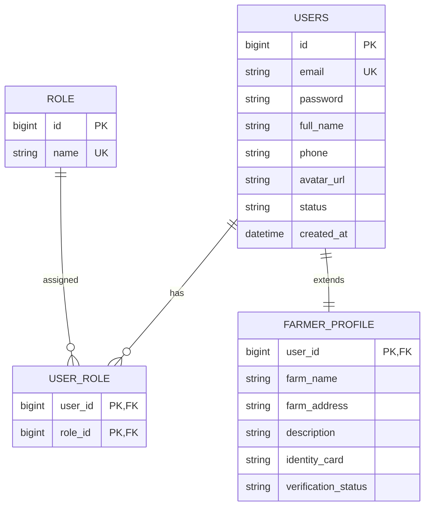

# Báo Cáo Phân Tích & Tối Ưu Hóa Thiết Kế Cơ Sở Dữ Liệu AgriMarket
*(Tài liệu chuẩn bị cho báo cáo đồ án môn SWP391 - Đại học FPT)*

Tài liệu này đánh giá chi tiết tính chuyên nghiệp trong thiết kế cơ sở dữ liệu hiện tại của hệ thống **AgriMarket**, sau khi file blueprint SQL [Agrimarket-system.sql](file:///d:/POW/Learn/FPT%20University/Ki_5/SWP391/Project/AgriMarket/AgriMarket/docs/Agrimarket-system.sql) đã được đồng bộ hóa khớp hoàn toàn với cấu trúc thực thể Java (JPA Entities) đang chạy trên hệ thống. 

Tài liệu chỉ ra các điểm hạn chế về mặt kiến trúc/logic nghiệp vụ và cung cấp các câu lệnh SQL tối ưu hóa để bạn chỉnh sửa cơ sở dữ liệu trở thành phiên bản hoàn thiện, sẵn sàng báo cáo giáo viên.

---

## I. Tổng Quan Về Dự Án AgriMarket
Hệ thống **AgriMarket** là một sàn thương mại điện tử kết nối trực tiếp **Nhà vườn/Nông dân (Farmer)** với **Khách mua hàng (Customer)** nhằm phân phối nông sản trực tiếp (F2C - Farm-to-Consumer).
- **Mục tiêu chính**: Giảm thiểu trung gian, giúp nông dân định giá và viết mô tả nông sản tốt hơn (hỗ trợ bởi AI), kết nối shipper/đối tác vận chuyển để giao nhận nông sản tươi sống nhanh chóng, hỗ trợ livestream bán hàng và đặt trước mùa vụ (Pre-order).
- **Các vai trò (Roles)**: Khách vãng lai (Guest), Khách mua hàng (Customer), Nhà vườn (Farmer), Đơn vị vận chuyển (Shipper/Partner), Quản trị viên (Admin).

---

## II. Đánh Giá Thiết Kế Database Hiện Tại (Có Chuyên Nghiệp Chưa?)

Sau khi đồng bộ hóa file SQL blueprint [Agrimarket-system.sql](file:///d:/POW/Learn/FPT%20University/Ki_5/SWP391/Project/AgriMarket/AgriMarket/docs/Agrimarket-system.sql) với code Java JPA, cấu trúc bảng đã khớp chính xác và sẵn sàng hoạt động mà không bị lỗi runtime. Tuy nhiên, nếu xét trên **tiêu chuẩn thiết kế hệ thống chuyên nghiệp (đặc biệt đối với đồ án SWP391 tại FPT University)**, cơ sở dữ liệu này vẫn tồn tại các điểm hạn chế lớn cần cải thiện:

### 1. Lỗi Logic Nghiệp Vụ Nghiêm Trọng: Đơn Hàng Đa Nhà Vườn (Multi-vendor Order Splitting)
*   **Vấn đề**: Khách hàng có thể đặt mua các sản phẩm từ Farmer A và Farmer B chung trong một giỏ hàng. Hiện tại, hệ thống tạo ra **duy nhất một bản ghi** trong bảng `orders` để đại diện cho toàn bộ giao dịch này.
*   **Rủi ro**: 
    *   Bảng `orders` chỉ có một trạng thái duy nhất (`status` và `payment_status`).
    *   Khi Farmer A xác nhận chuẩn bị hàng hoặc từ chối đơn hàng (trong [OrderService.java](file:///d:/POW/Learn/FPT%20University/Ki_5/SWP391/Project/AgriMarket/AgriMarket/src/main/java/org/example/agrimarket/service/OrderService.java#L256)), trạng thái của **toàn bộ đơn hàng** (bao gồm cả sản phẩm của Farmer B) đều bị cập nhật theo!
    *   Hệ thống không thể xử lý tình huống Farmer A giao hàng thành công nhưng Farmer B giao thất bại hoặc từ chối.
*   **Giải pháp chuyên nghiệp**: Chia đơn hàng thành mô hình **Parent-Child (Đơn cha - Đơn con)**. Đơn cha (`order_group`) lưu tổng tiền, thông tin thanh toán chung. Đơn con (`sub_order` hoặc `orders`) chia tách theo từng `farmer_id`, có trạng thái và shipper giao hàng riêng biệt.

### 2. Trùng Lặp Thông Tin Tài Khoản (User Entities Duplication)
*   **Vấn đề**: Ba thực thể `admin`, `customer`, và `farmer` nằm ở 3 bảng riêng biệt nhưng chứa thông tin giống nhau tới 80% (`full_name`, `email`, `password`, `phone`, `avatar_url`, `created_at`).
*   **Rủi ro**: Khi một khách hàng (Customer) muốn đăng ký trở thành nhà vườn (Farmer), hệ thống buộc phải nhân bản thông tin sang bảng `farmer`. Việc này dẫn đến trùng lặp dữ liệu, tăng nguy cơ mất đồng bộ mật khẩu/thông tin cá nhân và gây khó khăn khi quản trị Security Session (Spring Security).
*   **Giải pháp chuyên nghiệp**: Sử dụng thiết kế **RBAC (Role-Based Access Control)** với bảng chung `users` kết hợp với bảng `roles`, `user_role` (hoặc `user_roles`) và các bảng thông tin mở rộng (ví dụ: `farmer_profile` chứa thông tin chuyên biệt của nông trại).

### 3. Lỗi Kiến Trúc Liên Kết Đa Hình (Polymorphic Association)
*   Các bảng như `message`, `support_request`, `report` sử dụng cột dạng `sender_type` ('customer', 'farmer') và `sender_id` (hoặc `receiver_type`/`receiver_id`).
*   Đây là một phản mẫu (anti-pattern) trong SQL vì `sender_id` không thể khai báo khóa ngoại (FOREIGN KEY) ràng buộc trực tiếp vào cả hai bảng `customer` và `farmer` cùng lúc. Điều này phá vỡ tính toàn vẹn tham chiếu (Referential Integrity) của hệ thống.

### 4. Thiếu Chỉ Mục (Index) & Ràng Buộc Miền Giá Trị (Value Constraints)
*   File SQL gốc không khai báo các `INDEX` trên các trường tìm kiếm/lọc thường xuyên (như `email`, `status`, `created_at` hay các khóa ngoại). Khi dữ liệu lớn lên, các câu lệnh JOIN hoặc lọc danh sách đơn hàng sẽ cực kỳ chậm do phải quét toàn bộ bảng (Table Scan).
*   Các trường như `price` của sản phẩm hay `quantity` trong chi tiết đơn hàng thiếu ràng buộc giá trị dương (`CHECK (price >= 0)`), dẫn tới nguy cơ lỗi logic âm tiền.

---

## III. Các Câu Lệnh SQL Chỉnh Sửa & Tối Ưu Hóa (Actionable Queries)

Dưới đây là các truy vấn SQL (SQL Server dialect) giúp bạn tối ưu hóa cơ sở dữ liệu hiện tại lên mức chuyên nghiệp để báo cáo với giáo viên.

### 1. Chuẩn Hóa Tên Bảng (Consistent Naming Conventions)
Để đảm bảo tất cả bảng đều tuân theo quy tắc số ít (Singular) chuyên nghiệp, hãy đổi tên các bảng số nhiều còn sót lại bằng thủ tục `sp_rename` của SQL Server:

```sql
-- Đổi tên bảng categories -> category
EXEC sp_rename 'categories', 'category';
-- Đổi tên bảng messages -> message
EXEC sp_rename 'messages', 'message';
-- Đổi tên bảng support_requests -> support_request
EXEC sp_rename 'support_requests', 'support_request';
GO
```

### 2. Tạo Chỉ Mục Tối Ưu Hóa Hiệu Năng (Database Performance Indexes)
Giáo viên chấm DB sẽ đánh giá rất cao việc bạn chủ động tạo các chỉ mục để tăng tốc truy vấn hệ thống sàn:

```sql
-- Chỉ mục trên các khóa ngoại quan trọng để tăng tốc phép JOIN dữ liệu
CREATE INDEX IX_product_farmer ON product(farmer_id);
CREATE INDEX IX_product_category ON product(category_id);
CREATE INDEX IX_order_item_order ON order_item(order_id);
CREATE INDEX IX_order_item_product ON order_item(product_id);
CREATE INDEX IX_order_item_farmer ON order_item(farmer_id);
CREATE INDEX IX_orders_customer ON orders(customer_id);
CREATE INDEX IX_orders_partner ON orders(partner_id);

-- Chỉ mục trên các trường tìm kiếm và lọc dữ liệu thường xuyên
CREATE INDEX IX_customer_email ON customer(email);
CREATE INDEX IX_farmer_email ON farmer(email);
CREATE INDEX IX_product_status ON product(status);
CREATE INDEX IX_orders_status ON orders(status);
CREATE INDEX IX_orders_created_at ON orders(created_at);
GO
```

### 3. Thêm Các Ràng Buộc Miền Giá Trị Để Bảo Vệ Dữ Liệu (Check Constraints & Audit Columns)
Ngăn chặn các giá trị âm hoặc sai logic nghiệp vụ và bổ sung audit log thời gian sửa đổi:

```sql
-- Ràng buộc giá sản phẩm, số lượng tồn kho không được phép âm
ALTER TABLE product ADD CONSTRAINT CHK_product_price CHECK (price >= 0);
ALTER TABLE product ADD CONSTRAINT CHK_product_stock CHECK (stock_quantity >= 0);

-- Ràng buộc đơn giá và số lượng trong chi tiết đơn hàng
ALTER TABLE order_item ADD CONSTRAINT CHK_order_item_price CHECK (product_price >= 0);
ALTER TABLE order_item ADD CONSTRAINT CHK_order_item_qty CHECK (quantity > 0);

-- Ràng buộc số tiền thanh toán thực tế của hóa đơn
ALTER TABLE orders ADD CONSTRAINT CHK_orders_amount CHECK (amount >= 0);

-- Bổ sung cột cập nhật tự động (Audit columns) cho việc giám sát dữ liệu
ALTER TABLE product ADD updated_at DATETIME NULL;
ALTER TABLE orders ADD updated_at DATETIME NULL;
GO
```

---

## IV. Phương Án Nâng Cấp Kiến Trúc Cao Cấp (Khuyên Dùng Để Lấy Điểm 9, 10)

Nếu bạn muốn có một thiết kế CSDL thực sự xuất sắc để trình bày trong slide báo cáo hoặc bảo vệ trước hội đồng giám khảo, đây là 2 kiến trúc chuẩn hóa mà các hệ thống lớn thực tế áp dụng.

### Kiến Trúc 1: Giải Quyết Triệt Để Lỗi Trùng Lặp Tài Khoản (Unified User Schema)

Thay vì chia 3 bảng `admin`, `customer`, `farmer` độc lập, chúng ta hợp nhất tài khoản vào một bảng `users` trung tâm và sử dụng cơ chế Phân quyền (RBAC):



#### SQL Schema tương ứng cho kiến trúc hợp nhất User:
```sql
-- Tạo bảng Role
CREATE TABLE role (
    id BIGINT IDENTITY(1,1) PRIMARY KEY,
    name VARCHAR(50) UNIQUE NOT NULL -- 'ROLE_CUSTOMER', 'ROLE_FARMER', 'ROLE_ADMIN', 'ROLE_SHIPPER'
);

-- Tạo bảng Users trung tâm
CREATE TABLE users (
    id BIGINT IDENTITY(1,1) PRIMARY KEY,
    email VARCHAR(255) UNIQUE NOT NULL,
    password VARCHAR(255) NOT NULL,
    full_name NVARCHAR(255) NOT NULL,
    phone VARCHAR(20) UNIQUE,
    avatar_url NVARCHAR(500),
    status VARCHAR(20) CHECK(status IN ('active', 'banned', 'pending')) DEFAULT 'pending',
    created_at DATETIME DEFAULT GETDATE()
);

-- Bảng liên kết trung gian User - Role
CREATE TABLE user_role (
    user_id BIGINT NOT NULL,
    role_id BIGINT NOT NULL,
    PRIMARY KEY (user_id, role_id),
    FOREIGN KEY (user_id) REFERENCES users(id) ON DELETE CASCADE,
    FOREIGN KEY (role_id) REFERENCES role(id) ON DELETE CASCADE
);

-- Bảng lưu trữ thông tin chuyên biệt cho Farmer (Không trùng lặp tài khoản)
CREATE TABLE farmer_profile (
    user_id BIGINT PRIMARY KEY,
    farm_name NVARCHAR(255) NOT NULL,
    farm_address NVARCHAR(1000) NOT NULL,
    description NVARCHAR(MAX),
    identity_card VARCHAR(50),
    business_registration_url NVARCHAR(1000),
    vietgap_url NVARCHAR(1000),
    globalgap_url NVARCHAR(1000),
    organic_url NVARCHAR(1000),
    verification_status VARCHAR(20) CHECK(verification_status IN ('pending','verified','rejected')) DEFAULT 'pending',
    rating_average DECIMAL(3,2) DEFAULT 0,
    total_products INT DEFAULT 0,
    
    FOREIGN KEY (user_id) REFERENCES users(id) ON DELETE CASCADE
);
```

### Kiến Trúc 2: Giải Quyết Đơn Hàng Đa Nhà Vườn (Parent-Child Order Splitting Schema)

Để khách hàng có thể mua sắm từ nhiều nhà vườn trong một giỏ hàng mà không làm xung đột luồng xử lý đơn hàng của các nhà vườn khác nhau, ta triển khai cấu trúc đơn hàng 2 cấp:

*   **Đơn hàng cha (Order Group / Transaction)**: Quản lý tổng thanh toán, phương thức thanh toán, địa chỉ giao nhận và trạng thái thanh toán tổng thể.
*   **Đơn hàng con (Sub-Order)**: Đại diện cho một nhóm sản phẩm thuộc về một nhà vườn duy nhất. Mỗi đơn hàng con có mã vận đơn, trạng thái giao nhận và shipper riêng.

```sql
-- 1. Tạo bảng Đơn hàng cha
CREATE TABLE order_group (
    id BIGINT IDENTITY(1,1) PRIMARY KEY,
    group_code VARCHAR(100) UNIQUE NOT NULL,
    customer_id BIGINT NOT NULL,
    total_subtotal DECIMAL(18,2) NOT NULL,
    total_shipping_fee DECIMAL(18,2) NOT NULL,
    total_discount DECIMAL(18,2) NOT NULL,
    grand_total DECIMAL(18,2) NOT NULL,
    recipient_name NVARCHAR(255) NOT NULL,
    recipient_phone VARCHAR(20) NOT NULL,
    delivery_address NVARCHAR(1000) NOT NULL,
    payment_method NVARCHAR(100) NOT NULL,
    payment_status VARCHAR(20) CHECK(payment_status IN ('unpaid','paid','refunded')) DEFAULT 'unpaid',
    created_at DATETIME DEFAULT GETDATE(),
    
    FOREIGN KEY (customer_id) REFERENCES customer(id)
);

-- 2. Chỉnh sửa bảng orders đóng vai trò Đơn hàng con (Sub-Order) liên kết với Nhà vườn cụ thể
-- Bảng này sẽ lưu trữ thông tin xử lý riêng lẻ của từng nhà vườn
CREATE TABLE sub_order (
    id BIGINT IDENTITY(1,1) PRIMARY KEY,
    sub_order_code VARCHAR(100) UNIQUE NOT NULL,
    order_group_id BIGINT NOT NULL,
    farmer_id BIGINT NOT NULL, -- Xác định đơn này thuộc về nhà vườn nào
    status VARCHAR(20) CHECK(status IN ('pending','confirmed','preparing','shipping','delivered','cancelled','rejected')) DEFAULT 'pending',
    subtotal DECIMAL(18,2) NOT NULL,
    shipping_fee DECIMAL(18,2) NOT NULL,
    amount DECIMAL(18,2) NOT NULL, -- số tiền nhà vườn nhận được
    partner_id BIGINT NULL,        -- Shipper giao cho đơn này
    tracking_number VARCHAR(100),
    cancel_reason NVARCHAR(1000),
    shipper_notes NVARCHAR(1000),
    pod_photo NVARCHAR(MAX),
    detailed_status VARCHAR(50),
    created_at DATETIME DEFAULT GETDATE(),
    
    FOREIGN KEY (order_group_id) REFERENCES order_group(id) ON DELETE CASCADE,
    FOREIGN KEY (farmer_id) REFERENCES farmer(id),
    FOREIGN KEY (partner_id) REFERENCES partner(id)
);

-- 3. Cập nhật bảng order_item liên kết tới sub_order thay vì orders tổng
-- (Xóa bảng order_item cũ và tạo lại trỏ tới sub_order)
DROP TABLE IF EXISTS order_item;
CREATE TABLE order_item (
    id BIGINT IDENTITY(1,1) PRIMARY KEY,
    sub_order_id BIGINT NOT NULL,
    product_id BIGINT NOT NULL,
    product_name NVARCHAR(255) NOT NULL,
    product_price DECIMAL(18,2) NOT NULL,
    product_unit NVARCHAR(50),
    image_url NVARCHAR(1000),
    quantity INT NOT NULL CHECK(quantity > 0),
    subtotal DECIMAL(18,2) NOT NULL,
    
    FOREIGN KEY (sub_order_id) REFERENCES sub_order(id) ON DELETE CASCADE,
    FOREIGN KEY (product_id) REFERENCES product(id)
);
```

---

## V. Kết Luận & Khuyến Nghị Trình Bày Trước Giáo Viên

1.  **Chỉnh sửa nhanh để hệ thống chạy ổn định**: Hãy chạy các câu lệnh SQL ở **Mục III (Bước 1, 2, 3)** trực tiếp trên cơ sở dữ liệu SQL Server của bạn. Việc này giúp bổ sung chỉ mục (Indexes) để tăng hiệu năng và các ràng buộc miền dữ liệu (Check Constraints) tăng tính chặt chẽ.
2.  **Đưa các phân tích kiến trúc vào slide báo cáo**: Hãy đưa các phân tích ở **Mục II (Vấn đề Multi-vendor, Trùng lặp User, Đa hình)** vào phần *Đánh giá hệ thống / Hạn chế và Hướng phát triển* của slide báo cáo. Việc bạn nhận thức được các điểm hạn chế này và đề xuất giải pháp (như mô tả ở **Mục IV**) sẽ giúp nâng tầm đồ án SWP391 của bạn lên mức xuất sắc (điểm Giỏi/Xuất sắc) trong mắt hội đồng chấm điểm, thể hiện tư duy thiết kế hệ thống chuyên nghiệp.
